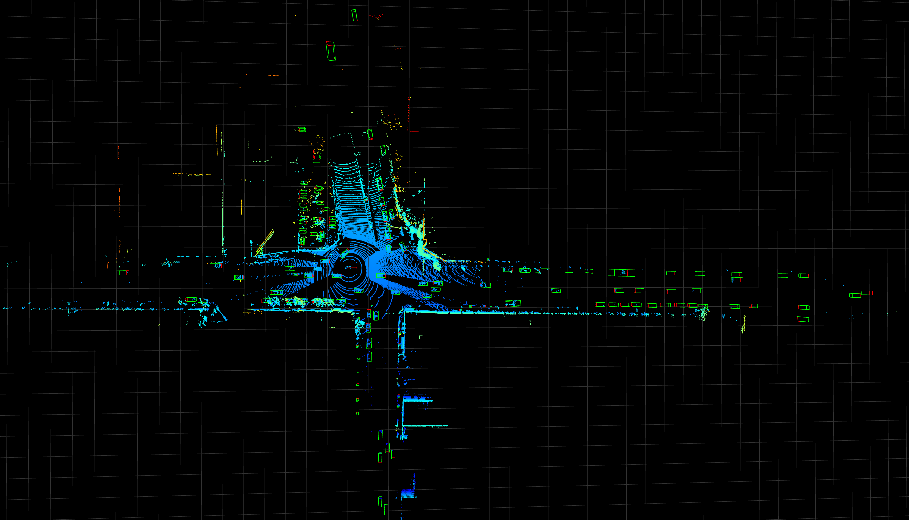

# pandaset_analysis

禾赛64线雷达数据集PandasSet的解析方法。

### Setup
1. 首先需要安装禾赛的API工具,参考```https://github.com/scaleapi/pandaset-devkit```
2. 修改```read_pansaset.py```中对应路径
3. 直接运行```python read_pansaset.py```

### 注意：

PandasSet中使用的数据集中的航向角设置与Kitti等略不相同。因此需要做以下修改：

1. 修改函数：geometry.lidar_points_to_ego
    
    原函数为
    ```angular2html
    def lidar_points_to_ego(points, lidar_pose):
        lidar_pose_mat = _heading_position_to_mat(
            lidar_pose['heading'], lidar_pose['position'])
        transform_matrix = np.linalg.inv(lidar_pose_mat)
        return (transform_matrix[:3, :3] @ points.T + transform_matrix[:3, [3]]).T 
    ```
    需要修改为：
    ```angular2html
    def lidar_points_to_ego(points, lidar_pose):
        lidar_pose_mat = _heading_position_to_mat(
            lidar_pose['heading'], lidar_pose['position'])
        transform_matrix = np.linalg.inv(lidar_pose_mat)
        rotate_yaw = np.arctan2(transform_matrix[1][0], transform_matrix[0][0])
        return (transform_matrix[:3, :3] @ points.T + transform_matrix[:3, [3]]).T, rotate_yaw
    ```
    增加一个返回值的目的在于将航向角调整到我们想要训练的算法规定的航向角之上
2. 航向角设置：
    1. ```OpenPCDet```：应用以上修改的程序解析出的lidar与label可直接用于训练
    2. ```second.pytorch```：需要将以上得到的航向角做一下变换：```math.pi * 1.5 - x```

### 可视化

1. 此处可视化使用的是开源可视化工具Open3D：```pip install open3d``` 即可
2. 修改```show.py```对应的文件路径
3. 直接运行```python show.py```

### 最终结果

